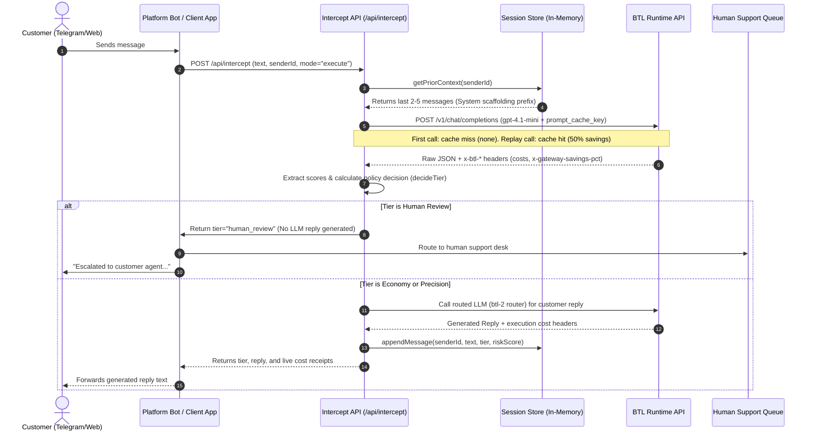

# Dispatch: Cost-Aware AI Routing & Intelligence Allocation Middleware

Dispatch is an open-source, production-ready AI routing middleware built on top of **BTL Runtime**. It sits directly in the request path of your user-facing applications (e.g. support bots, email channels, messaging services) to decide how much inference capacity each message deserves. 

By analyzing four core triage scores (Risk, Complexity, Confidence, and Business Value) via a lightweight proxy triage step, Dispatch determines the most cost-effective tier to handle the message. It prevents you from wasting budget on premium models (e.g., GPT-4) for routine inquiries, routing them to fast, cheap models (Economy) instead, while dynamically escalating high-risk queries to premium models (Precision) or routing them away from LLM inference entirely to human operators (Human Review).

Every single execution is logged and evaluated with **unclamped cost receipts** extracted directly from BTL Runtime response headers (`x-btl-*`), proving exactly what you spent versus what you saved compared to a naive "always premium" model strategy.

---

## Table of Contents
1. [Core Architecture & System Flow](#1-core-architecture--system-flow)
2. [Visual Design System & Aesthetics](#2-visual-design-system--aesthetics)
3. [Triage Scoring Metrics & Routing Tiers](#3-triage-scoring-metrics--routing-tiers)
4. [Multi-Message Session Memory & Context Engine](#4-multi-message-session-memory--context-engine)
5. [Interactive Scenario Simulation: Policy Playground](#5-interactive-scenario-simulation-policy-playground)
6. [API Reference (`/api/intercept`)](#6-api-reference-apiintercept)
7. [Telegram Bot Integration](#7-telegram-bot-integration)
8. [Pricing Honesty & BTL Gateway Caching Mechanics](#8-pricing-honesty--btl-gateway-caching-mechanics)
9. [Local Development & Setup](#9-local-development--setup)

---

## 1. Core Architecture & System Flow

The Dispatch middleware behaves as an interceptor. The sequence diagram below details how messages are checked, scored, and answered:



---

## 2. Visual Design System & Aesthetics

Dispatch adheres to a premium, monospace-influenced editorial aesthetic. There are no generic SaaS templates or rounded elements:
- **Square chips (2px border-radius)**: Replace standard pill badges. They utilize geometric prefixes:
  - `·` Economy (Green text, HSL tailored borders, light background fill)
  - `›` Precision (Orange/Pink text, warning status)
  - `▲` Human Review / Reputation Risk (Deep red/pink highlight)
- **Line-Number Diff Cost Bars**: Visual progress representations use monospaced code structures (e.g. `01` / `02` markers) mimicking git diff grids. Inset shadows on the leading edge of the progress bars give depth.
- **Evidence Card Receipts**: The BTL details panel displays as a raw 2-column receipt container, split by a `VERIFIED VIA BTL RUNTIME` hairline divider, utilizing clean border-bottom separators for metadata.
- **Micro-Animations**: All cards are responsive to hover actions, featuring a smooth `150ms` translate lift (`-translate-y-0.5`) and border brightness increases.

---

## 3. Triage Scoring Metrics & Routing Tiers

Every ticket is triaged on the fly against four core dimensions, scored from `0.0` to `1.0`:

### Scoring Dimensions
1. **`riskScore`**: Assesses financial, legal, and reputational consequence. Serious complaints (like chargeback threats) score `0.8+`. Minor shipping delays with loud anger score low (`0.3`), because the *consequence* is minor. Tone is ignored — financial threat is prioritised.
2. **`complexity`**: Evaluates reasoning difficulty. Fact-based queries are low complexity. Multiphase troubleshooting claims require higher cognitive capability, which forces routing to premium models.
3. **`confidence`**: Represents the triage model's certainty. Ambiguous tickets trigger low confidence, which automatically biases the router toward Precision or Human Review.
4. **`businessValue`**: Customer value flags (e.g., lifetime loyalty indicator, size of shopping basket). Higher business value acts as a buffer to route borderline cases to the Precision tier.

### Triage Logic (`lib/policy.ts`)
The router resolves the metrics into three final decisions:
- **Economy Tier (`·`)**: Routine queries. When the budget is strained (calculated as `remainingBudget / ticketsLeft < 0.15`), the policy automatically tightens threshold boundaries, routing borderline cases to Economy to preserve capital.
- **Precision Tier (`›`)**: High-complexity or high-risk cases that require the highest quality reasoning.
- **Human Review (`▲`)**: Skips LLM calls entirely. Serious legal issues, chargeback threats, or credentials leaks are immediately queued for human support.

---

## 4. Multi-Message Session Memory & Context Engine

Support queries rarely occur in isolation. A single terse complaint following two unanswered messages indicates a critical situation. Dispatch tracks this via an in-memory session manager:

### Storage Layer (`lib/session-store.ts`)
- Keyed by `senderId` (e.g., Telegram chat ID or user UUID).
- Retains only the last **5 messages** to limit token consumption and memory footprint.
- **Prior Context Injection**: Past inputs and their resolved tiers are appended as a system prompt prefix, instructing the triage model to score the query based on the conversation trajectory.
- **Frequency Signals**: Calculates how many messages were received in the last 10 minutes. If the count exceeds 3, the `riskScore` is automatically scaled to account for rapid contact.
- **UI Thread Layout**: On the `/dispatch` dashboard, consecutive messages from the same sender are visually grouped in a left-aligned vertical timeline, highlighting the conversation position (`msg N`) and rendering an escalation arrow (`↑`) if the risk score exceeds the prior message.

---

## 5. Interactive Scenario Simulation: Policy Playground

The dashboard features the **Policy Playground** (`components/PolicyPlayground.tsx`), a pure client-side what-if simulator:

- **Zero API Cost**: It replays the actual `decideTier()` logic against the batch run's cached triage scores. Because the raw scores have already been collected during the live SSE stream, sliding playground parameters incurs **no new network calls, no new latency, and no BTL cost**.
- **Interactive Controls**:
  - *Hypothetical Starting Budget* ($0.02 to $1.00): Drag to see how policy constraints adapt to different financial limits.
  - *Escalation Threshold* (0.30 to 0.95): Adjust to see how stingy or generous the router behaves before assigning Precision.
  - *Economy-Tier Threshold* (0.10 to 0.60): Adjust the boundary for routine inquiries.
- **Payoff Metrics**: Displays simulated counts for Economy, Precision, Human Review, and total savings in real time as the sliders are dragged.

---

## 6. API Reference (`/api/intercept`)

The intercept API behaves as a lightweight proxy, returning triage data, routing logic, cost evidence, and generated auto-replies.

### Request Body
```json
{
  "text": "My order has been delayed for three weeks. If it doesn't arrive by tomorrow, I am going to file a chargeback with my bank.",
  "channel": "telegram",
  "senderId": "5382214636",
  "mode": "execute",
  "remainingCapital": 0.3,
  "ticketsLeft": 1
}
```

### Response Body
```json
{
  "channel": "telegram",
  "senderId": "5382214636",
  "tier": "precision",
  "reason": "Healthy budget allowed Precision Tier inference.",
  "scores": {
    "riskScore": 0.9,
    "complexity": 0.7,
    "confidence": 0.9,
    "businessValue": 0.5,
    "signals": [
      { "name": "Chargeback threat", "confidence": "HIGH" },
      { "name": "Shipping delay complaint", "confidence": "HIGH" }
    ],
    "dominantFactor": "Chargeback threat detected",
    "classificationBadge": "Chargeback Risk"
  },
  "policy": {
    "considered": {
      "economy": "rejected",
      "precision": "selected",
      "humanReview": "rejected"
    },
    "decisionPath": [
      "Chargeback Risk",
      "Borderline case",
      "Healthy budget",
      "Precision Tier"
    ]
  },
  "evidence": {
    "requestId": "req_86f7c60f",
    "cacheTier": "hit (50%)",
    "benchmarkCost": 0.000364,
    "customerCharge": 0.000182,
    "saved": 0.000182,
    "triageRequestId": "req_86f7c60f",
    "triageCustomerCharge": 0.000182,
    "triageBenchmarkCost": 0.000364,
    "triageSaved": 0.000182,
    "conversationLength": 2,
    "escalationTrend": true,
    "priorMessageCount": 1
  },
  "shadowCosts": {
    "shadowCostAlwaysStrong": 0.1368,
    "shadowCostAlwaysCheap": 0.0137,
    "shadowCostRandom": 0.0752
  },
  "actualSpend": 0.000182,
  "reply": "I sincerely apologize for the delay. Your package is scheduled for delivery tomorrow. We have also credited $15 back to your account as an apology for the inconvenience."
}
```

---

## 7. Telegram Bot Integration

A standalone bot is located in `telegram-bot/`. It polls Telegram and queries the Next.js API in `execute` mode, passing the Telegram chat ID as the `senderId` to maintain session context:

### Bot Event Handling (`telegram-bot/index.ts`)
```typescript
bot.on('message', async (msg) => {
  const chatId = msg.chat.id;
  const text = msg.text;
  if (!text || text.startsWith('/')) return;

  try {
    const res = await fetch(DISPATCH_API_URL, {
      method: 'POST',
      headers: { 'Content-Type': 'application/json' },
      body: JSON.stringify({
        text,
        channel: 'telegram',
        senderId: String(chatId),
        mode: 'execute'
      })
    });

    const data = await res.json();
    if (data.tier === 'human_review') {
      await bot.sendMessage(chatId, "⚠️ Ticket flagged for review. An agent will contact you shortly.");
      return;
    }
    if (data.reply) {
      await bot.sendMessage(chatId, data.reply);
    }
  } catch (err) {
    console.error("Bot dispatch failure:", err);
  }
});
```

---

## 8. Pricing Honesty & BTL Gateway Caching Mechanics

Unlike simulated dashboards, **Dispatch does not clamp or hide numbers**. It displays raw gateway headers, showing how cost optimization behaves under real-world conditions.

### A. Why Per-Call Savings can be Negative
BTL Runtime charges a retail markup above the raw wholesale provider cost on cold/unoptimized routes. When no prompt cache hits occur:
$$\text{Customer Charge} > \text{Benchmark Cost}$$
This results in a negative $\text{Saved}$ value ($\text{Benchmark} - \text{Customer Charge} < 0$). We display this negative savings value transparently.

Real savings are achieved by the routing policy itself: routing 80–90% of routine messages to the Economy tier instead of paying for a premium model on every call yields significant policy savings, independent of individual gateway cache hits.

### B. Triggering Gateway Prompt Caching
To achieve prompt caching on BTL's gateway, the following configuration must be met:
1. **Shared-Savings Model**: Switch the triage model from BTL's auto-router (`btl-2`) to a direct shared-savings model (**`gpt-4.1-mini`**).
2. **Enable Storing**: Set **`"store": true`** and pass a stable **`"metadata": { "prompt_cache_key": "dispatch-triage-v1" }`** parameter.
3. **Prefix Ordering**: Structure the API call so the static scoring rubric (System prompt instructions) is evaluated first, and variable text (User query) is appended last.

### C. The 50/50 Shared-Savings Calculation
BTL Runtime splits the cache-savings 50/50 with the workspace. The pricing formula is:
$$\text{Customer Charge} = \text{Actual Upstream Cost} + 0.5 \times (\text{Benchmark Cost} - \text{Actual Upstream Cost})$$

For a prompt-cache hit, the raw upstream cost drops to $0.00$:
$$\text{Customer Charge} = 0.00 + 0.5 \times (\text{Benchmark Cost} - 0.00) = 0.5 \times \text{Benchmark Cost}$$

For example:
- **Call 1 (Cold Triage)**: Cost is **`$0.000422`** (Benchmark cost `$0.000364` plus retail markup). Cache tier is `none`.
- **Call 2 (Cache Hit)**: Cost is **`$0.000182`** (exactly $50\%$ of the `$0.000364` benchmark).
- **Savings**: Savings equals **`$0.000182`** ($50\%$ savings pct). The cache status is resolved as **`hit (50%)`**.

---

## 9. Local Development & Setup

### Requirements
- Node.js 18+
- BTL Runtime `GATEWAY_API_KEY`

### 1. Environment Setup
Create a `.env.local` file in the root directory:
```env
GATEWAY_API_KEY=your_btl_runtime_api_key_here
```

Create a `.env` file in the `telegram-bot` directory:
```env
TELEGRAM_BOT_TOKEN=your_telegram_bot_token_here
DISPATCH_API_URL=http://localhost:3000/api/intercept
```

### 2. Next.js Web Dashboard
```bash
# Install dependencies
npm install

# Run the dev server
npm run dev
```
Open `http://localhost:3000` to start triaging.

### 3. Telegram Connector Bot
```bash
# Navigate to the bot directory
cd telegram-bot

# Install bot dependencies
npm install

# Run the TypeScript compiler/process
npm start
```
Go to Telegram and type messages to watch Dispatch react in real-time.
