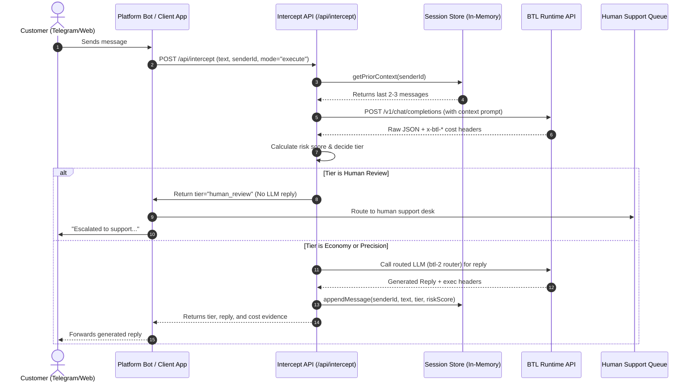

# Dispatch: Intelligence Allocation & Cost-Aware AI Routing Middleware

Dispatch is a production-ready, lightweight AI routing middleware built on top of **BTL Runtime**. It evaluates incoming customer support messages across multiple dimensions (risk, complexity, confidence, business value) to allocate the most cost-effective intelligence tier. 

Instead of routing every query to an expensive model, Dispatch routes routine questions to a fast, cheap model (Economy) and reserves high-stakes queries for a premium model (Precision). If a message exposes legal, security, or critical refund threats, Dispatch bypasses LLM inference entirely and routes it directly to a human agent queue (Human Review).

Every decision is backed by live, raw BTL Runtime response headers (`x-btl-*`) showing actual micro-dollar costs, allowing you to track exactly what you spent versus what a naive "always premium" strategy would have cost instead.

---

## Table of Contents
1. [Core Architecture & System Flow](#1-core-architecture--system-flow)
2. [Visual Design System](#2-visual-design-system)
3. [Routing Tiers & Scoring Logic](#3-routing-tiers--scoring-logic)
4. [Multi-Message Conversation Memory](#4-multi-message-conversation-memory)
5. [API Reference (`/api/intercept`)](#5-api-reference-apiintercept)
6. [Telegram Bot Integration](#6-telegram-bot-integration)
7. [The Honesty Page: Live Pricing Reality](#7-the-honesty-page-live-pricing-reality)
8. [Local Development & Setup](#8-local-development--setup)

---

## 1. Core Architecture & System Flow



---

## 2. Visual Design System

The frontend dashboard of Dispatch rejects standard "generic AI template" UI patterns in favor of a premium, monospaced editorial aesthetic:
- **Geometric Stat Chips**: No rounded pill badges. All labels use 2px border-radius square chips with geometric icon markers:
  - `·` Economy (Green)
  - `›` Precision (Orange)
  - `▲` Human Review / Reputation Risk (Pink/Red)
- **Line-Number Diff Cost Bars**: Visual progress bars utilize styled `01`/`02` line-numbered diff structures in monospaced code fonts. The progress bar fill uses an inset leading-edge shadow for depth.
- **Evidence Card Receipts**: The BTL Runtime debugging console is designed as a clean, two-column receipt structure with a `VERIFIED VIA BTL RUNTIME` hairline separator and border-bottom row dividers.
- **Transitions**: Interactions have subtle `translateY(-0.5px)` hover-lifts and border-brightness transitions (`150ms`).

---

## 3. Routing Tiers & Scoring Logic

Every message parsed by Dispatch undergoes multi-variable triage evaluation:

### A. The Scoring Matrix (0.0 to 1.0)
- **`riskScore`**: Assesses financial, legal, and reputational exposure. Serious or quiet threats of chargebacks or public shaming score high (`0.8+`).
- **`complexity`**: Evaluates reasoning depth. Simple facts (e.g. shipping times) score low; multi-part complaints require higher reasoning.
- **`confidence`**: Triage model's self-assessment. Ambiguous inputs get low confidence, which biases the system towards escalation.
- **`businessValue`**: Customer loyalty markers. Higher value boosts borderline tickets to Precision.

### B. Decision Path Routing
1. **Economy Tier (`·`)**: Used for routine inquiries. As the session's **remaining capital** drops below defined thresholds, the system automatically tightens policy constraints to route borderline tickets to Economy to preserve budget.
2. **Precision Tier (`›`)**: Reserved for high-risk or complex tickets where routing quality cannot be compromised.
3. **Human Review (`▲`)**: Active legal threats, privacy leaks, or critical billing failures skip automated replies entirely.

---

## 4. Multi-Message Conversation Memory

To prevent routing decisions from occurring in isolation (where a customer gets increasingly frustrated over several messages but each individual query looks minor), Dispatch implements a database-free, session-scoped memory layer.

### In-Memory Storage (`lib/session-store.ts`)
- Keyed by `senderId` (e.g. Telegram chat ID).
- Retains only the last **5 messages** to bound memory usage and prevent token bloating.
- Automatically calculates:
  - **Prior Context**: Prepended to the triage API call to inform the LLM of the customer's conversation history.
  - **Message Frequency**: Triggers risk boosts if a customer sends multiple messages in a tight window (indicates agitation).
  - **Escalation Trend**: Compares the current message's `riskScore` with the prior message. If it increases, an `escalationTrend: true` flag is returned.

### Visualizing Escalation
When a multi-message conversation is routed, the `/dispatch` dashboard groups them into connected thread groups with a left border connector, displaying a `msg N` indicator and a rising arrow (`↑`) next to the routing chip to indicate escalating risk.

---

## 5. API Reference (`/api/intercept`)

The intercept API behaves as an intelligent proxy.

### Request Body
```json
{
  "text": "I'm going to file a chargeback if you don't issue a refund immediately.",
  "channel": "telegram",
  "senderId": "5382214636",
  "mode": "execute",
  "remainingCapital": 0.284,
  "ticketsLeft": 1
}
```

### Response Body (Sanitized Live Output)
```json
{
  "channel": "telegram",
  "senderId": "5382214636",
  "tier": "precision",
  "reason": "Healthy budget allowed Precision Tier inference.",
  "scores": {
    "riskScore": 0.9,
    "complexity": 0.7,
    "confidence": 0.9,
    "businessValue": 0.5,
    "signals": [
      { "name": "Chargeback threat", "confidence": "HIGH" },
      { "name": "Request for refund", "confidence": "HIGH" }
    ],
    "dominantFactor": "Threat to file a chargeback detected",
    "classificationBadge": "Chargeback Risk"
  },
  "policy": {
    "considered": {
      "economy": "rejected",
      "precision": "selected",
      "humanReview": "rejected"
    },
    "decisionPath": [
      "Chargeback Risk",
      "Borderline case",
      "Healthy budget",
      "Precision Tier"
    ]
  },
  "evidence": {
    "requestId": "req_cd56c2c0",
    "cacheTier": "none",
    "benchmarkCost": 0.000156,
    "customerCharge": 0.003485,
    "saved": -0.003329,
    "triageRequestId": "req_cd56c2c0",
    "triageCustomerCharge": 0.003485,
    "triageBenchmarkCost": 0.000156,
    "triageSaved": -0.003329,
    "conversationLength": 3,
    "escalationTrend": true,
    "priorMessageCount": 2
  },
  "shadowCosts": {
    "shadowCostAlwaysStrong": 0.1368,
    "shadowCostAlwaysCheap": 0.0137,
    "shadowCostRandom": 0.0752
  },
  "actualSpend": 0.003485,
  "reply": "I sincerely apologize for the inconvenience. We have received your request and will process your refund immediately. Please check your email for confirmation."
}
```

---

## 6. Telegram Bot Integration

The standalone bot in `telegram-bot/` hooks into the intercept API automatically using the user's unique chat ID as the `senderId`.

### Flow Logic (`telegram-bot/index.ts`)
```typescript
bot.on('message', async (msg) => {
  const chatId = msg.chat.id;
  const text = msg.text;
  if (!text || text.startsWith('/')) return;

  const res = await fetch(DISPATCH_URL, {
    method: 'POST',
    headers: { 'Content-Type': 'application/json' },
    body: JSON.stringify({
      text,
      channel: 'telegram',
      senderId: String(chatId),
      mode: 'execute'
    })
  });

  const data = await res.json();
  if (data.tier === 'human_review') {
    await bot.sendMessage(chatId, "Escalating to our team...");
    return;
  }
  if (data.reply) {
    await bot.sendMessage(chatId, data.reply);
  }
});
```

---

## 7. The Honesty Page: Live Pricing Reality

Unlike simulated dashboards, **Dispatch uses raw headers**. This reveals a real gateway pricing reality:

> **Why `saved` is sometimes negative:**
> BTL Runtime's pricing specifies that a workspace pays the benchmark price when optimized, split 50/50. However, on cold calls without cache hits, the gateway applies a retail markup above the raw wholesale provider cost (visible in the difference between `x-btl-customer-charge` and `x-btl-benchmark-cost`).
> 
> Dispatch does **not** clamp or hide negative savings. We compute `saved = benchmarkCost - customerCharge` and show it raw. Real savings are realized by the policy routing itself: directing 80-90% of messages to Economy instead of paying flat-rate Premium on every call.

---

## 8. Local Development & Setup

### Requirements
- Node.js 18+
- A valid `GATEWAY_API_KEY` from Bad Theory Labs

### 1. Environment Setup
Create a `.env.local` file in the root directory:
```env
GATEWAY_API_KEY=your_btl_runtime_api_key_here
```

Create a `.env` file in the `telegram-bot` directory:
```env
TELEGRAM_BOT_TOKEN=your_telegram_bot_token_here
DISPATCH_API_URL=http://localhost:3000/api/intercept
```

### 2. Next.js Web Dashboard
```bash
# Install dependencies
npm install

# Run the dev server
npm run dev
```
Open `http://localhost:3000` to start triaging.

### 3. Telegram Connector Bot
```bash
# Navigate to the bot directory
cd telegram-bot

# Install bot dependencies
npm install

# Run the TypeScript compiler/process
npm start
```
Go to Telegram and type messages to watch Dispatch react in real-time.
